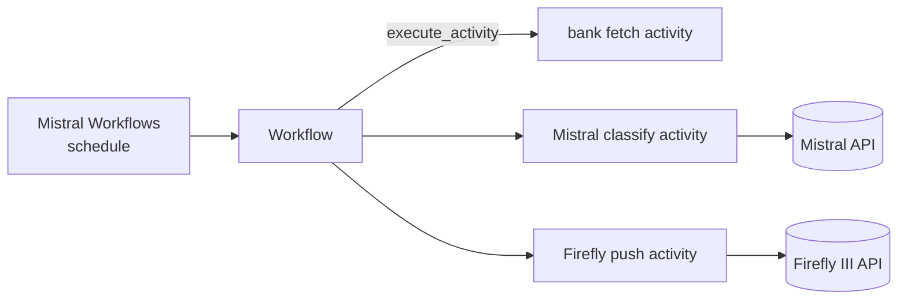

# Architecture

The repo is a [uv workspace](https://docs.astral.sh/uv/concepts/projects/workspaces/) so that
shared libraries can grow alongside the worker without splitting the codebase.

```
uni-fly/
├── pyproject.toml          # workspace root, tool config, exclude-newer guard
├── packages/
│   └── worker/             # unifly-worker — the only deployable today
│       ├── pyproject.toml
│       ├── src/unifly_worker/
│       │   ├── worker.py       # bootstrap, run_worker(...)
│       │   ├── workflows/      # @workflow.define classes
│       │   ├── activities/     # @activity coroutines
│       │   ├── clients/        # external HTTP/SDK wrappers
│       │   ├── config.py       # pydantic-settings
│       │   └── logging.py      # structlog setup
│       └── tests/
└── docs/                   # this MkDocs site
```

## Runtime topology



The worker process holds workflow definitions and activity implementations. The Mistral
Workflows runtime drives execution, retries, and scheduling — the worker only registers
work via `workflows.run_worker([...])`.

## Future packages

When shared logic grows (Firefly III client, classifier prompts, bank credentials store)
each will land as a sibling package under `packages/`, depended on by the worker via
`[tool.uv.sources]` workspace links.
